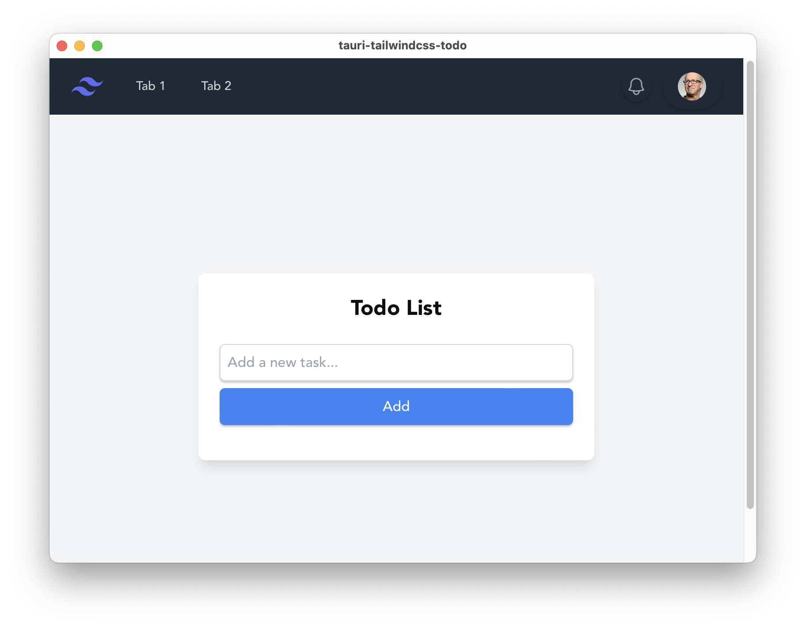

# Tauri + React + Typescript

This template should help get you started developing with Tauri, React and Typescript in Vite.

## Recommended IDE Setup

- [VS Code](https://code.visualstudio.com/) + [Tauri](https://marketplace.visualstudio.com/items?itemName=tauri-apps.tauri-vscode) + [rust-analyzer](https://marketplace.visualstudio.com/items?itemName=rust-lang.rust-analyzer)

## Database Diagram


# How to build ?
1. Install all packages
```
npm i
```

2. Build the vite frontend app
```
npm run build
```

3. Build the bundle to native app
```
npm run tauri build
```

4. Wait for Rust to generate the binary